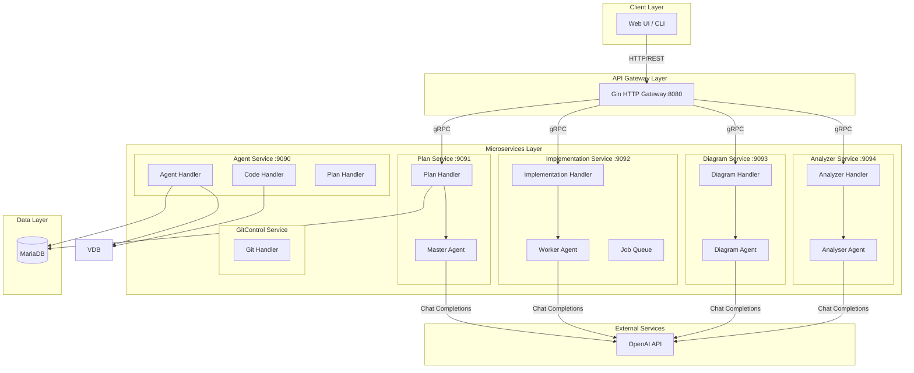
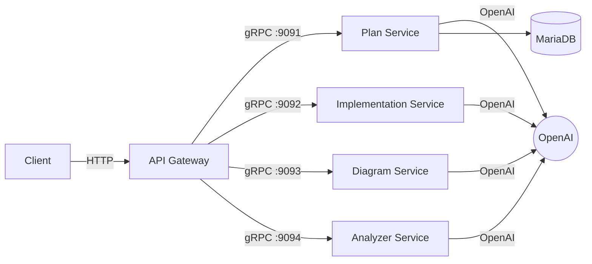
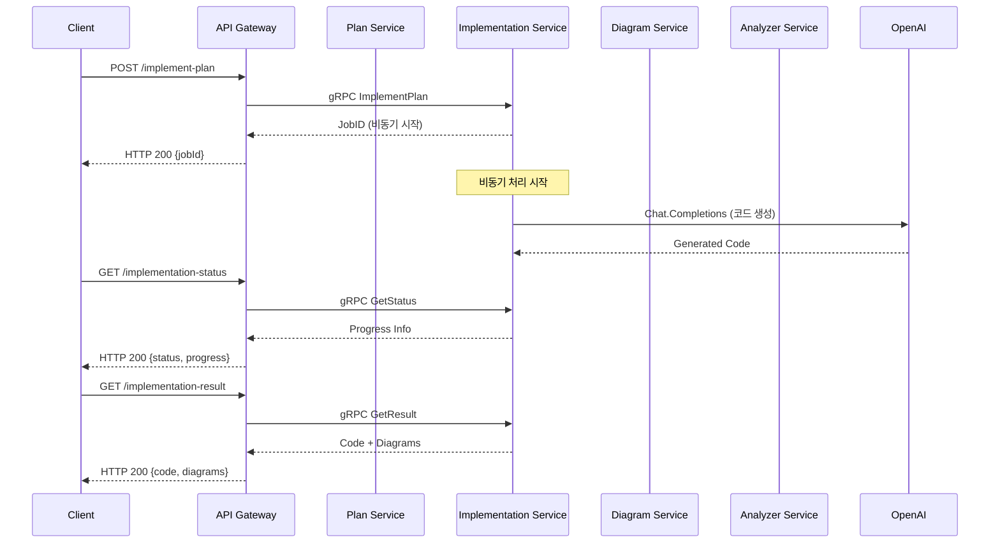
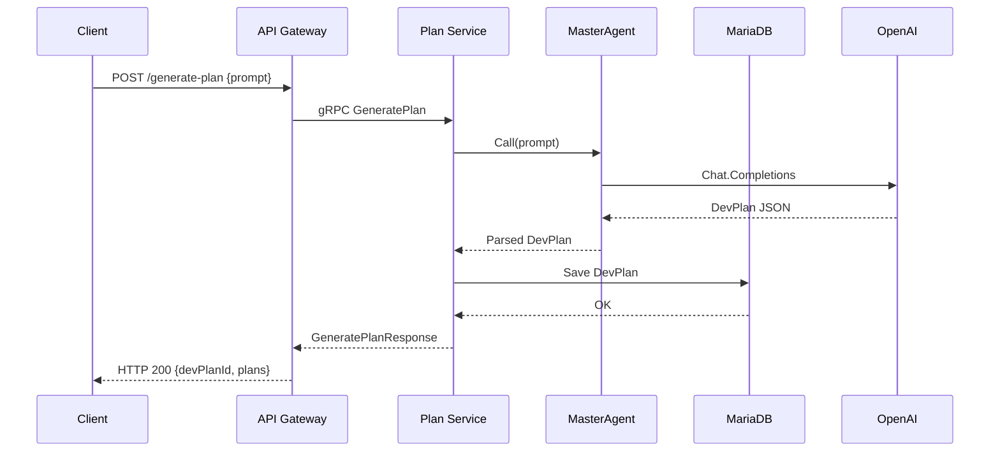

# CodeV42: AI 기반 개발 워크플로우 자동화 시스템

**LLM을 활용하여 아이디어를 코드로 전환하는 과정을 가속화하는 AI 기반 개발 보조 도구입니다.**

이 시스템은 개발자의 요구사항을 분석하여 개발 계획을 수립하고, 실제 동작하는 코드를 생성하며, 코드 구조에 대한 설명과 다이어그램까지 자동으로 생성하여 전체 개발 라이프사이클을 지원합니다.

## 핵심 기능

- **계획 수립 (Planning):** 사용자의 요구사항(자연어)을 분석하여 태스크를 정의하고, 세부적인 개발 계획을 자동으로 수립합니다.
- **코드 생성 (Code Generation):** 수립된 계획에 따라 Go, Python 등 다양한 언어의 코드를 생성합니다.
- **코드 분석 및 설명 (Code Analysis & Explanation):** 생성된 코드나 기존 코드의 로직, 구조, 의존성을 분석하고 이해하기 쉬운 자연어 설명을 생성합니다.
- **다이어그램 생성 (Diagram Generation):** 코드의 아키텍처, 클래스 구조 등을 시각적으로 표현하는 다이어그램을 자동으로 생성합니다.

## 기술 스택

<p align="center">
  
  
  
  
  
</p>

## 시스템 아키텍처

본 시스템은 MSA(Microservice Architecture)를 기반으로 설계되었으며, 각 서비스는 독립적으로 개발, 배포 및 확장이 가능합니다.



### 서비스 구성

| 서비스 | 경로 | 포트 | 역할 |
|--------|------|------|------|
| **API Gateway** | `internal/gateway` | 8080 | 외부 HTTP 요청을 수신하여 내부 gRPC 서비스로 라우팅 |
| **Plan Service** | `services/plan` | 9091 | 개발 계획 수립, 수정, 조회 (MasterAgent 활용) |
| **Implementation Service** | `services/implementation` | 9092 | 비동기 코드 구현 및 상태 관리 (WorkerAgent 활용) |
| **Diagram Service** | `services/diagram` | 9093 | Mermaid 다이어그램 생성 (Class, Sequence, Flowchart) |
| **Analyzer Service** | `services/analyzer` | 9094 | 코드 병합 및 세그먼트 분석/설명 생성 |
| **Agent Service** | `services/agent` | 9090 | 벡터 DB 연동, 임베딩 및 통합 에이전트 기능 |
| **GitControl Service** | `services/gitcontrol` | - | Git 저장소 생성, 클론, 브랜치, 커밋 관리 |

### 서비스별 AI 에이전트

각 서비스는 특화된 AI 에이전트를 통해 OpenAI API와 연동합니다:

- **MasterAgent** (Plan Service): 사용자 요구사항을 분석하여 개발 계획 구조화
- **WorkerAgent** (Implementation Service): 계획에 따른 실제 코드 구현
- **DiagramAgent** (Diagram Service): 코드 기반 Mermaid 다이어그램 생성
- **AnalyserAgent** (Analyzer Service): 코드 병합 및 세그먼트별 설명 생성

## 시작하기

### Prerequisites
- Go
- Docker
- `make`

### 로컬 환경에서 실행

1.  **저장소 클론:**
    ```bash
    git clone https://github.com/your-repo/codev42.git
    cd codev42
    ```

2.  **프로토콜 버퍼 컴파일:**
    `services/agent/pb` 내의 `.proto` 파일로부터 gRPC 코드와 Go 코드를 생성합니다.
    ```bash
    make proto
    ```

3.  **API 게이트웨이 실행:**
    `internal/gateway` 디렉토리의 Go 코드를 실행하여 API 게이트웨이 서버를 시작합니다.
    ```bash
    make gateway-server
    ```
    (Agent 등 다른 서비스들도 별도로 실행해야 합니다.)

4.  **단위 테스트 실행:**
    프로젝트 전체의 단위 테스트를 실행합니다.
    ```bash
    make test
    ```

### Docker 이미지 빌드

각 서비스의 Docker 이미지를 빌드합니다.

- **전체 이미지 빌드:**
  ```bash
  make image
  ```

- **Agent 서비스 이미지 빌드:**
  ```bash
  make image-agent
  ```

- **Gateway 서비스 이미지 빌드:**
  ```bash
  make image-gateway
  ```

## 사용 방법

1.  **요구사항 전달:** API Gateway를 통해 프로젝트 생성에 대한 요구사항을 자연어로 전달합니다.
2.  **계획 수립:** Agent 서비스가 LLM을 통해 요구사항을 분석하고 개발 계획을 수립하여 사용자에게 제시합니다.
3.  **코드 생성:** 사용자가 계획을 승인하면, 계획에 따라 Git Control 서비스와 연동하여 레포지토리를 생성하고 코드를 작성합니다.
4.  **결과 확인:** 생성된 코드, 설명, 다이어그램을 확인하고 추가적인 개발을 진행합니다.

## 환경 변수

다음 환경 변수를 설정해야 합니다. 기본값은 `services/agent/configs/config.go` 참고.

- `OPENAI_API_KEY` (필수): OpenAI API Key
- `MYSQL_USER` (기본: `mainuser`)
- `MYSQL_PASSWORD` (필수)
- `MYSQL_HOST` (기본: `localhost`)
- `MYSQL_PORT` (기본: `3306`)
- `MYSQL_DB` (기본: `codev`)
- `PINECONE_API_KEY` (필수, 기본 구현은 Pinecone 사용)
- `MILVUS_HOST` (기본: `localhost`)
- `MILVUS_PORT` (기본: `19530`)
- `GRPC_PORT` (기본: `9090`)

참고: 운영 배포에서는 MariaDB를 사용합니다. 로컬/배포 설정 값은 `deployments/mariadb/values.yaml`를 확인하세요. 환경 변수명은 호환을 위해 `MYSQL_*`를 그대로 사용했습니다

## HTTP API (Gateway)

### Plan Endpoints
| Method | Endpoint | 설명 |
|--------|----------|------|
| `POST` | `/generate-plan` | 요구사항 기반 개발 계획 생성 |
| `POST` | `/modify-plan` | 기존 계획 수정 |
| `GET` | `/get-plan-list` | 프로젝트별 계획 목록 조회 |
| `GET` | `/get-plan-by-id` | 특정 계획 상세 조회 |

### Implementation Endpoints
| Method | Endpoint | 설명 |
|--------|----------|------|
| `POST` | `/implement-plan` | 계획 기반 코드 구현 |
| `GET` | `/implementation-status` | 구현 작업 상태 조회 |
| `GET` | `/implementation-result` | 구현 결과 조회 |

### Diagram Endpoints
| Method | Endpoint | 설명 |
|--------|----------|------|
| `POST` | `/generate-diagrams` | 모든 다이어그램 병렬 생성 |
| `POST` | `/generate-class-diagram` | 클래스 다이어그램 생성 |
| `POST` | `/generate-sequence-diagram` | 시퀀스 다이어그램 생성 |
| `POST` | `/generate-flowchart-diagram` | 플로우차트 생성 |

### Analyzer Endpoints
| Method | Endpoint | 설명 |
|--------|----------|------|
| `POST` | `/combine-code` | 여러 코드 조각 병합 |
| `POST` | `/analyze-code-segments` | 코드 세그먼트 분석 및 설명 |

요청/응답 스키마는 각 서비스의 gRPC `.proto` 파일 정의를 따릅니다.

## 서비스 통신 흐름

### 전체 요청 흐름



### 구현 플로우 시퀀스



### 계획 수립 플로우 시퀀스


